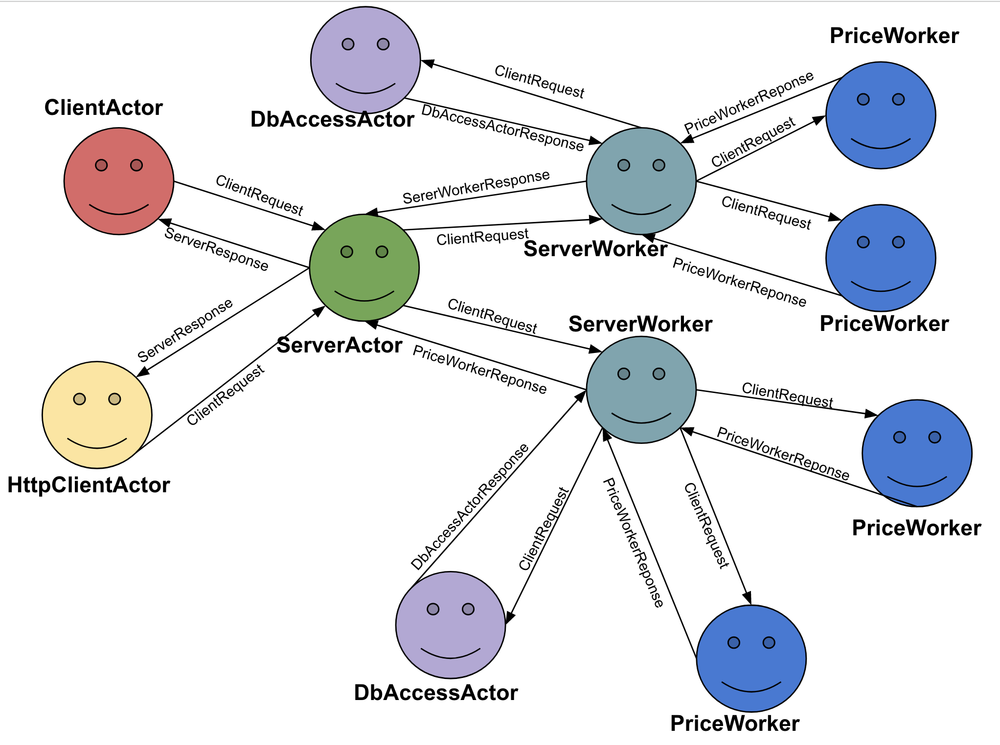

# Price compare

The following repository is solution to the assignment from Distributed Systems class.

The objective of this assignment was to implement an actor-based system handling requests about prices
of various (hardcoded) products. ClientActor make requests to ServerActor which dispatches ServerWorkers. They
obtain price of a product from PriceWorker. Alternatively price is obtained by HttpClientActor who pulls data from
opineo.pl website. DbAccessActor logs requests made by the ClientActor to the database. Requests can be made concurrently.

The assigment has been implemented in Scala using Akka framework.

## Diagram of the system

